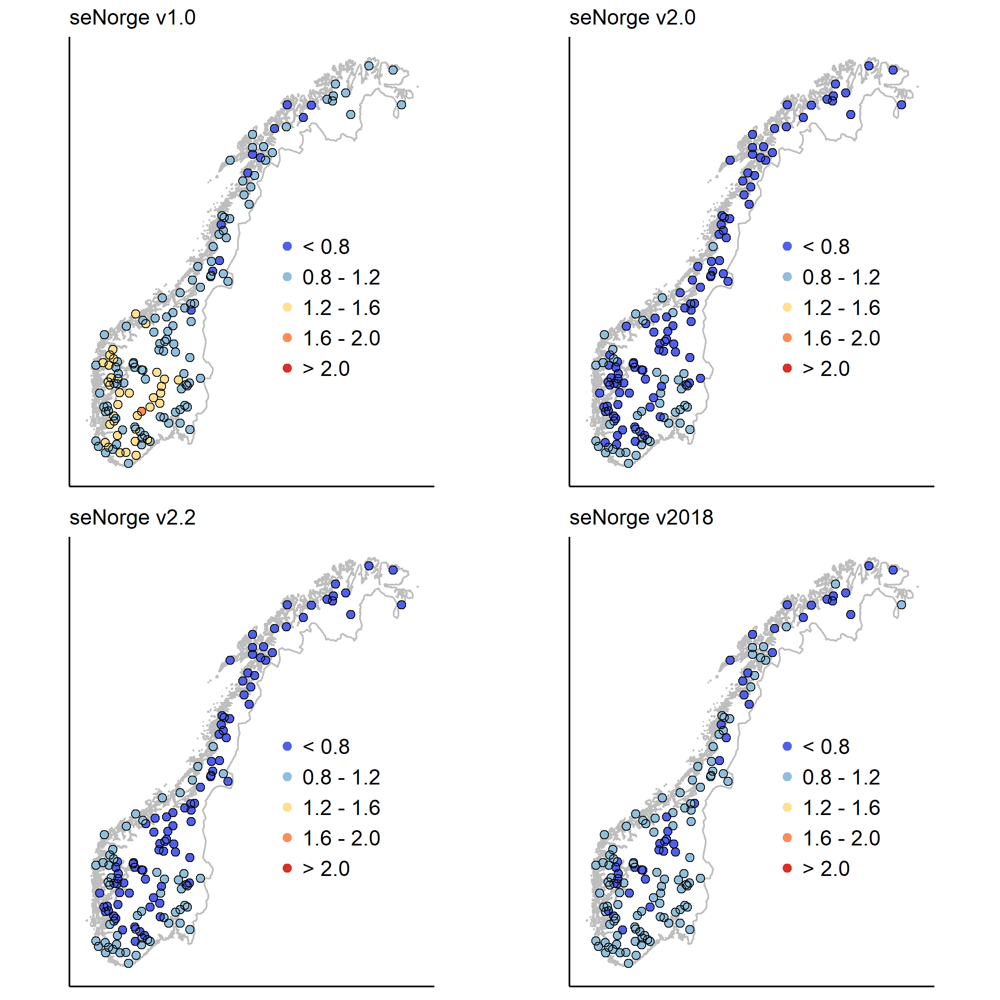

# Analysis of seNorge precipitation data

In this analysis, we evaluate several of the seNorge precipitation products against observed runoff and estimated actual evapotranspiration for a set of catchments throughout mainland Norway. The runoff measurements are generally of high quality, but have not been rigorously tested for all stations. Catchments with high degree of glacierization have been omitted. The goal of this analysis is mainly to test whether the precipitation products can capture the annual water balance for the individual watersheds. We use data for the period from 2000-01-01 to 2013-12-31 in this analysis.

## Results

### Precipitation against runoff

The scatter plots below show precipitation against runoff (catchment averages) for the whole study period. The versions 1.0 and 2018 capture the catchment water balance much better than the versions 2.0 and 2.2. For all products, the intercept in the regression equation varies between 306 and 374 mm/year. Likely, these values roughly matches the average annual evapotranspiration for Norway.

### Precipitation against runoff plus evapotranspiration

The scatter plots below show precipitation against runoff plus evapotranspiration (catchment averages) for the whole study period. Evapotranspiration was aquired from the [MODIS satellite product](http://www.ntsg.umt.edu/project/modis/mod16.php). This analysis, thus, takes all water balance terms into account unlike the evaluation shown above. We find that the version 2018 captures the water balance much better than the remaining products since:

- The intercept of the regression line is closer to zero than any of the other products.
- The slope of the regression line is near unity, and only the seNorge v1.0 shows somewhat better performance in this respect.
- The squared correlation coefficient is highest among the products.

Thus, overall the newest product shows a clear improvement over the older ones. Note also the homoscedasticity of the error terms in the seNorge2018 product.

### Precipitation divided by runoff

The maps below show catchment precipitation divided by runoff. These maps reflect the results shown above:

- v1.0 - Precipitation is higher than runoff, in particular in southern Norway.

- v2.0 and v2.2 - Precipitation is lower than runoff in many regions, mostly in the mountains and northern Norway.

- v2018 - For many stations, the ratio between precipitation and runoff is within the range from 0.8 to 1.2. The largest deviations from this range are found in the southeastern part of Norway.

### Precipitation divided by runoff plus actual evapotranspiration

The maps below show catchment precipitation divided by runoff plus actual evapotranspiration. Thus, these maps show the inputs divided by the outputs for each watershed, and the ratio should ideally equal one. The results are similar to those presented in the maps above. However, note that the high ratio between precipitation and runoff visible in the southeastern part of Norway in the maps above for v2018 have disappeared; the estimated precipitation in this region seems roughly correct when taking evapotranspiration into account.

### Correlation between annual precipitation and runoff

The maps below shows the correlation coeffient between annual values of precipitation and runoff. All products show rather similar results in this respect, at least when shown as individual values on a map.

### Conclusions

The seNorge2018 product seems to outperform the earlier versions, in particular the versions 2.0 and 2.2. However, precipitation in the seNorge2018 product is somewhat low compared to the sum of discharge and evapotranspiration indicated by the slope of regression line, which equals 0.87. Thus, still some improvements possible. Note that this analysis does only reveal some information about the long term water balance, but nothing about single precipitation events.

## Code structure

Data for this analysis was downloaded using the `download_data.R` script, which depends on the NVE internal R package `NVEDATA`. The plots were generated with the `analysis_senorge.R` script. Note that raw data is not stored in this repository due to their large sizes.